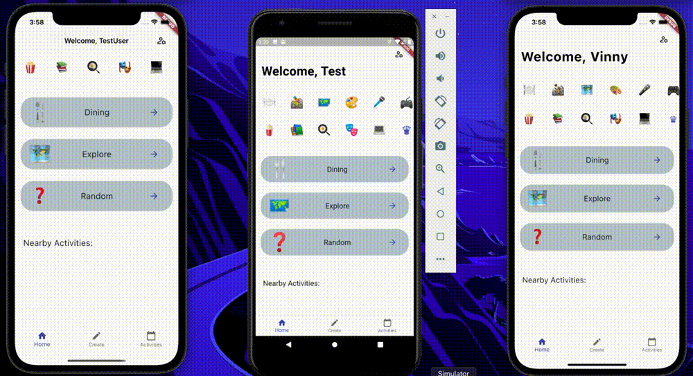
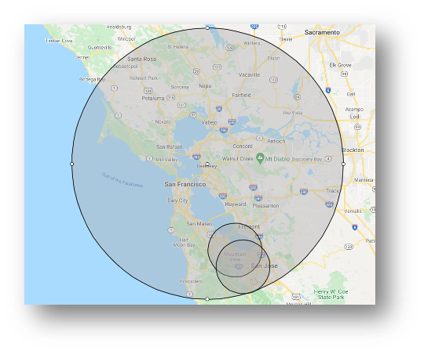
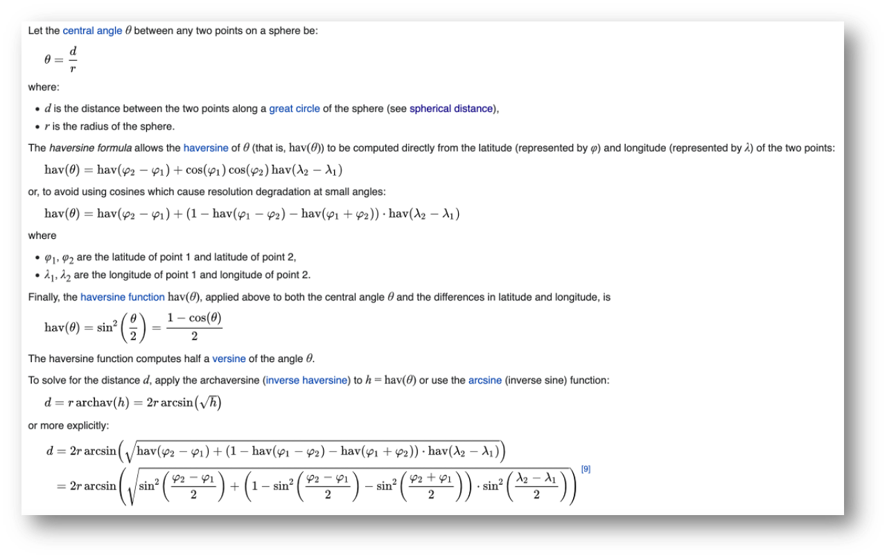
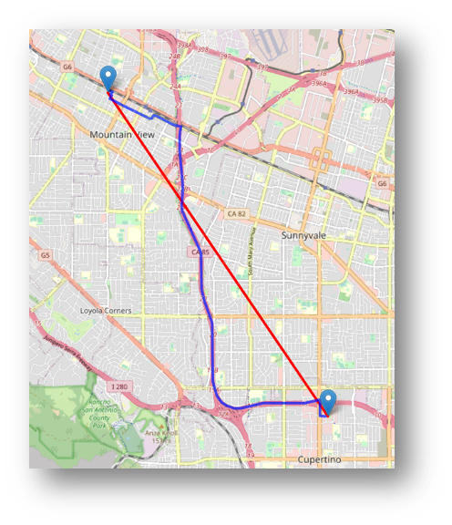
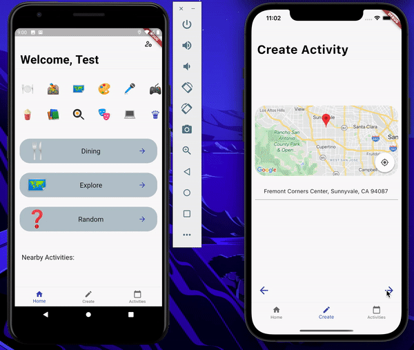
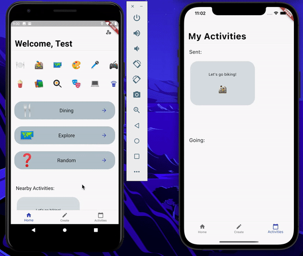

<div id="top"></div>
<br />
<div align="center">
  <a href="https://github.com/vineet2420/pair-finder">
    
  </a>

  <h3 align="center">Activity Matcher/Pair Finder</h3>
  <p align="center">
    A quick cross platform application built to connect nearby users  <br /> with shared interests. 
  </p>
</div>


## Background

The modern world feels like a very small place with six degrees of separation and social networking apps increasing visibility to everyone on its platform around the world. Yet why is it the case when we explore a new city for the first time, it is as if we are completely alone and left to make new connections by ourselves? Is there a better solution? iPair seeks to help individuals meet new people and engage in their activities together. 

> Goal: Get users off the app as quick as possible. 🤔

The point is not to squeeze as much capital out of each user and profit from obtrusive advertisements. Everything about the application is developed to be as intuitive, quick, and seamless as to not detract from your activities.


<details open>
<summary>Hide Demo</summary>

<center>
<table>
<tr>

</tr>
<tr>

</tr>
</table>
</center>

</details>

<p align="right">(<a href="#top">back to top</a>)</p>

### Built With

Front end:

* [Flutter - UI Framework](https://flutter.dev/)
	* [Dart - Language used within Flutter](https://dart.dev/)

Back end:

* [AWS EC2 Ubuntu 18.04.6 LTS - Hosting](https://aws.amazon.com/ec2/)
* [Apache 2 HTTP Server - Web Server](https://httpd.apache.org/)
* [Gunicorn 'Green Unicorn' - Python Web Server Gateway Interface](https://gunicorn.org/)
* [Flask Microframework - REST API](https://flask.palletsprojects.com/en/2.0.x/)
* [PostgreSQL - Relational Database](https://www.postgresql.org/)

<p align="right">(<a href="#top">back to top</a>)</p>


## Getting Started

Run this project within your own environment.

### Prerequisites

* [Install Flutter - https://docs.flutter.dev/get-started/install](https://docs.flutter.dev/get-started/install)
* [Install PostgreSQL - https://www.postgresql.org/download/](https://www.postgresql.org/download/)
* [Install Python 3 - https://www.python.org/downloads/](https://www.python.org/downloads/)

### Installation

1. Clone the repo
   ```
   git clone https://github.com/vineet2420/Pair-Finder.git
   ```
   
   or w/ ssh
   ```
   git clone git@github.com:vineet2420/Pair-Finder.git
   ```
2. Change directories 
   ```
   cd pair-finder/flutter-ui/
   ```
3. Get dependencies 
	```
	flutter pub get
	```
4. Open `flutter-ui` folder with Android Studio or VSCode

<p align="right">(<a href="#top">back to top</a>)</p>

### Configuration

##### Set up database

1. Login 
	```
	psql -U "username"
	``` 
	and follow password prompt
	
	_Make sure your PATH variable is correctly defined otherwise you will run into issues installing the python driver in the later steps_
2. Create coredb database 
	```
	CREATE DATABASE coredb;
	```
3. Connect to coredb
	```
	\c coredb;
	```
4. Create tables

	4a. User Table 
	
	```
	CREATE TABLE "user" (uid SERIAL PRIMARY KEY, first_name CHARACTER VARYING(50)[] NOT NULL, last_name CHARACTER VARYING(50)[] NOT NULL, email CHARACTER VARYING(255)[] NOT NULL, username CHARACTER VARYING(15)[] NOT NULL, password CHARACTER VARYING(64)[] NOT NULL, radius FLOAT);
	```
	Expected output: CREATE TABLE
	
	4b. Activities Table
	
	```
	CREATE TABLE "activities" (aid SERIAL PRIMARY KEY, owner TEXT NOT NULL, act_name TEXT NOT NULL, act_desc TEXT NOT NULL, act_latitude FLOAT NOT NULL, act_longitude FLOAT NOT NULL, pair TEXT, time TEXT NOT NULL, address TEXT NOT NULL);
	```
	Expected output: CREATE TABLE

<p align="right">(<a href="#top">back to top</a>)</p>

##### Set up local web server

1. Change directory _(from flutter-ui)_
	```
	cd ../flask-server/
	```
2. Edit secret.py
	```
	vim secret.py
	```

	2a. Add your postgres user's password to the return type of `getDbPass()`
	
	2b. Change the password salt to your own unique byte encoding in the `getSalt()` method
3. Create a virtual environment (venv)
	```
	python3 -m venv ./venv
	```
4. Activate the venv
	```
	source venv/bin/activate
	```
5. Install the following packages
		
	```
	pip install flask
	```
	
	```
	pip install flask-socketio
	```
	
	```
	pip install gunicorn
	```
	
	```
	pip install eventlet==0.30.2
	```
	
	```
	pip install psycopg2
	```

6. Copy the complete address the server is now listening at, most likely: 

	```
	http://127.0.0.1:8000
	```
	
7. Go back to the flutter-ui directory opened with Android Studio or VSCode in the installation step and open 📜constants.dart located under 
	<pre>
	📦 lib
	┣ 📂 ActivityFlow
 	┣ 📂 Controlller
 		┗ 📜 activity_controller.dart
 		┗ 📜 activity_state_provider.dart
 		┗ 📜 auth_controller.dart
 		┗ 📜 constants.dart
	</pre>

8. Replace the String `host` variable from the aws ec2 address to the local web server address previously copied.

<p align="right">(<a href="#top">back to top</a>)</p>

##### Add API Keys (Last step!)

1. Go to [https://cloud.google.com/docs/authentication/api-keys](https://cloud.google.com/docs/authentication/api-keys) 
and get started with the Google Cloud Console API Dashboard.

2. Enable the following API services:
	* Maps SDK for iOS
	* Maps SDK for Android
	* Maps JavaScript API

3. In the flutter-ui directory, add your API key to the following files:

	_Note: this is not the best practice for production applications but is suitable for our development environment_
	* `ios/Runner/AppDelegate.swift` (line: 13)
	* `android/app/src/main/AndroidManifest.xml` (line: 12)
	* `web/index.html` (line: 29)

<p align="right">(<a href="#top">back to top</a>)</p>

<!-- USAGE EXAMPLES -->
## Technical Details

##### REST API

| <div style="width:50px">User</div>     |  <div style="width:250px">Details    </div>                                                                                                                                         | <div style="width:50px">Activity   </div>          | <div style="width:250px">Details            </div>                                                                        |
|----------|-----------------------------------------------------------------------------------------------------------------------------------------------------|----------------------|--------------------------------------------------------------------------------------------|
| /login   | Get an authenticated user's data. <br /><br /> **Args:** email, password                                                                                             | /activity/create     | Post a new event. <br /> **Args:** owner, actname, actdesc, actlat, actlong, creationtime, actaddress |
| /signup  | Post a new user with all account data. <br /> **Args:** fname, lname, uname, email, password                                                                   | /activity/fetch      | Get events within the client’s radius. <br /> **Args:** userlat, userlong, userradius                 |
| /getuser | Get user data from a uid. Background task within caching layer after initial login to synchronize data changes from different platforms. <br /> **Args:** uid  | /activity/fetchGoing | Get all events the client is attending. <br /> **Args:** pair                                         |
|          |                                                                                                                                                     | /activity/fetchSent  | Get all events sent by the client. <br /> **Args:** owner                                             |
|          |                                                                                                                                                     | /activity/addUser    | Put the user into the request event, notify the event owner. <br /> **Args:** pair                    |
|          |                                                                                                                                                     | /activity/setRadius  | Put the client’s radius to persist with login on multiple devices. <br /> **Args:** radius, uid       |

<p align="right">(<a href="#top">back to top</a>)</p>

#### Distance Calculations
* [Haversine Formula](https://en.wikipedia.org/wiki/Haversine_formula) used to retrieve the orthodromic distance between two latitude and longitude points. 
* [Server side:](https://github.com/vineet2420/pair-finder/blob/d32c310bd5f7f45db26b9d53993bcfb9cbb2bff0/flask-server/activity.py#L68-L70) applied through query when fetching all the activities within the user’s radius. Calculate each distance, then check if the computed distance is ≤ the user’s radius.
* [Client side:](https://github.com/vineet2420/pair-finder/blob/d32c310bd5f7f45db26b9d53993bcfb9cbb2bff0/flutter-ui/lib/Controller/activity_controller.dart#L290-L301) applied when another user creates an activity, the data payload is distributed to all connected devices. 
	* If the connected client is within the radius of the activity, it is added to the nearby activities list and displays a notification on the screen.

<details>
<summary>View Formula and Visual</summary>
<table>
<tr>

</tr>
<tr>

</tr>
</table>
</details>

[Formula Source](https://en.wikipedia.org/wiki/Haversine_formula)


<p align="right">(<a href="#top">back to top</a>)</p>

#### Real-Time Communication
* [Flask-SocketIO](https://flask-socketio.readthedocs.io/en/latest/#flask-socketio) websocket implemented for full duplex communication over a single TCP connection.
* Client: Dart socket_io_client 1.0.2 which is a ported version of JavaScript Node.js library - Socket.io-client v2.0.1~v3.0.3


<details>

<summary>View Demos</summary>


<p float="left">
<center>


</center>
</p>

</details>


<p align="right">(<a href="#top">back to top</a>)</p>

#### Dynamic Events

* [Dart provider:](https://pub.dev/packages/provider) ^6.0.1 package used to manage state of various events. 
* ChangeNotifier implemented for a producer and consumer relationship.
	* notifyListeners() called when producer needs to update all the consumers.
* Instances used –
	1. Adding Activity objects to nearByActivities, sentActivities, and attendingActivities lists.
	2. User adjusts radius which requires altering nearByActivities list.
	3. Transitioning to a new tab bar widget page outside of the class where the tab bar is defined without using callbacks.

For a more comprehensive deep dive into all of the functionality implemented:
[view these slides](https://github.com/vineet2420/pair-finder/blob/main/readmeFiles/DeepDive.pptx). 


<p align="right">(<a href="#top">back to top</a>)</p>


## Known Improvements Required

- [ ] Convert server side queries to postgres database into an Object Relational Mapping to prevent attacks
- [ ] Add an authentication layer between the client and server to prevent the API from being accessible to all unidentified requests
- [ ] Remove secret.py file containing sensitve information from version control (left in for your ease when duplicating this repo)
- [ ] Remove API keys from UI files

<p align="right">(<a href="#top">back to top</a>)</p>


## Acknowledgments

All credit during development stems from these extremely helpful resources which have cumulatively brought the application into its current stable state. 

* [Flutter API Reference Documentation](https://api.flutter.dev/)
* [Flask Documentation](https://flask.palletsprojects.com/en/2.0.x/)
* [PostgreSQL 14.1 Documentation](https://www.postgresql.org/files/documentation/pdf/14/postgresql-14-A4.pdf)
* [Amazon Elastic Compute Cloud Documentation](https://docs.aws.amazon.com/AWSEC2/latest/UserGuide/concepts.html)
* [Flask-SocketIO Documentation](https://flask-socketio.readthedocs.io/en/latest/)
* [Green Unicorn Python WSGI HTTP Server Documentation](https://docs.gunicorn.org/en/stable/)
* [Psycopg – PostgreSQL Database Adapter Documentation](https://www.psycopg.org/docs/)
* [Dart Provider Package - Producer/Consumer Relationship Documentation](https://pub.dev/packages/provider)

<p align="right">(<a href="#top">back to top</a>)</p>